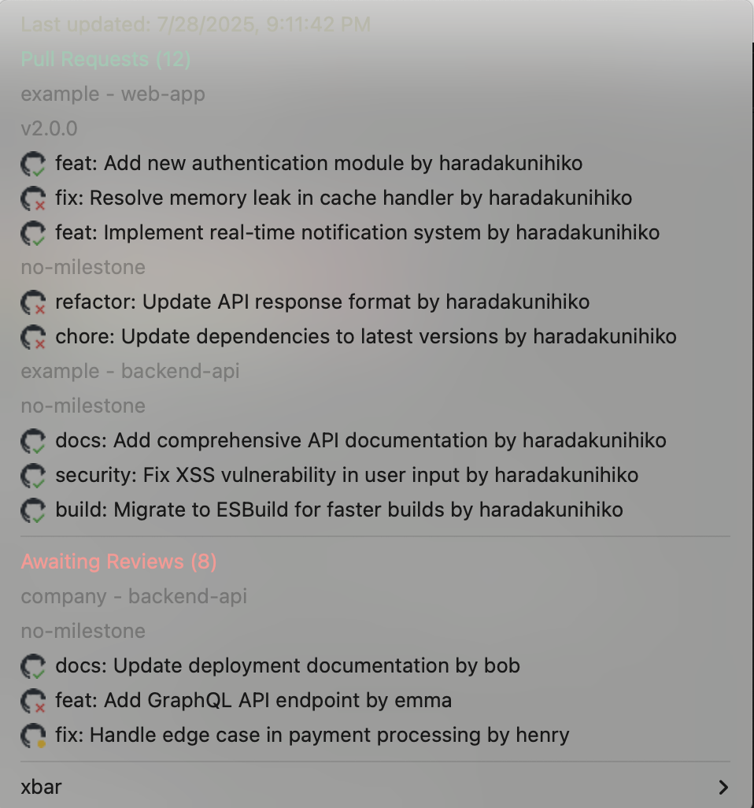
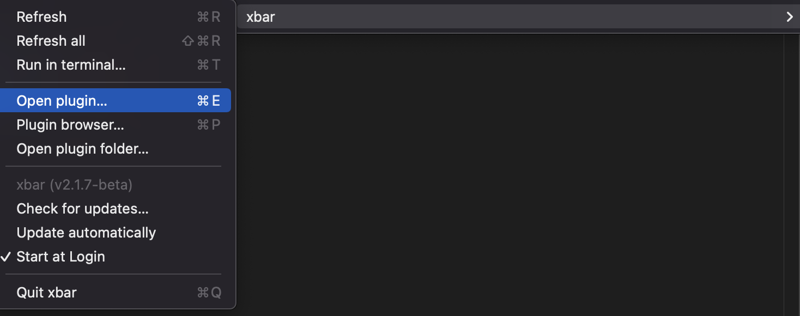
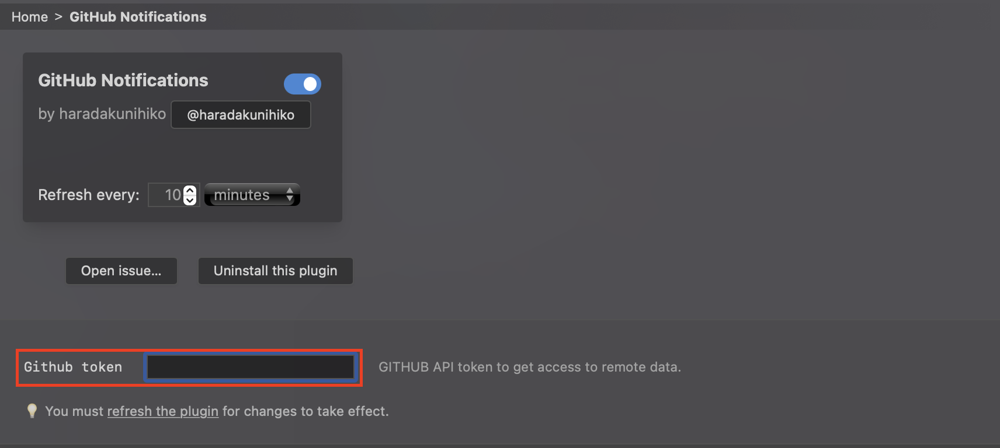

# Plugins

## GitHub Issues Xbar Plugin

Display GitHub Pull Requests in your menu bar.



The following information can be displayed:

*   Pull Requests you created
*   Pull Requests assigned to you for review
*   Issues and Pull Requests assigned to you

### Features

*   Quickly check your GitHub tasks from the menu bar
*   Written in Deno for easy setup

### Prerequisites

*   [Deno](https://deno.land/) must be installed

### Installation

1.  Clone this repository or download the `github.10m.ts` file
2.  Place the `github.10m.ts` file in the Xbar plugins directory using one of the following methods:
    *   **Create a symbolic link:**
        Run the following command in your terminal. Replace `<path_to_plugin_directory>` with the actual path to the `src` directory containing `github.10m.ts`:
        ```bash
        ln -s <path_to_plugin_directory>/src/github.10m.ts ~/Library/Application\ Support/xbar/plugins/github.10m.ts
        ```
    *   **Copy the file directly:**
        Copy the `github.10m.ts` file to `~/Library/Application Support/xbar/plugins/` directory

### Configuration

1.  Click the Xbar icon in the menu bar and select "Open plugins..."

    

2.  Find `github.10m.ts` in the plugin list and configure it:
    *   **Setting up GitHub Token:** Configure the personal access token required for the plugin to access the GitHub API. You can create a token from the [GitHub settings page](https://github.com/settings/tokens). Required scopes are `repo` (if including private repositories) or `public_repo` (for public repositories only)

    

3.  After configuration, refresh the plugin by selecting "Refresh all plugins" from the Xbar menu or "Refresh" from the individual plugin menu

# Contributing

Please submit bug reports and feature requests via Issues or Pull Requests.
