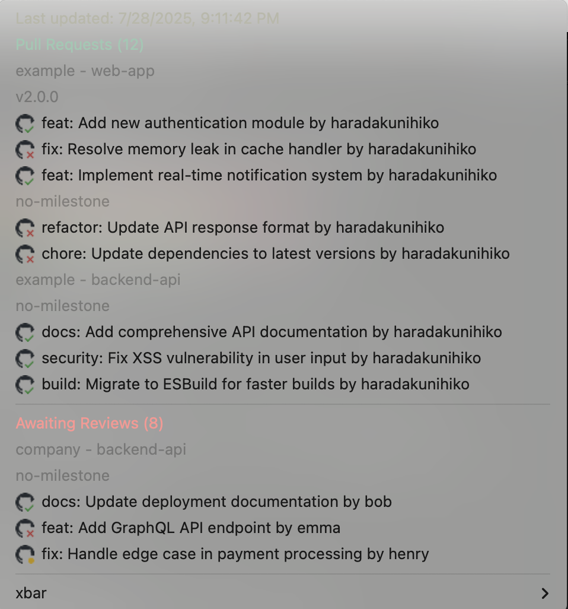

# Plugins

## GitHub Issues Xbar Plugin

Display GitHub Pull Requests in your menu bar.



The following information can be displayed:

*   Pull Requests you created
*   Pull Requests assigned to you for review
*   Issues and Pull Requests assigned to you

### Features

*   Quickly check your GitHub tasks from the menu bar
*   Written in Deno for easy setup

### Prerequisites

*   [Deno](https://deno.land/) must be installed
*   [GitHub CLI (`gh`)](https://cli.github.com/) must be installed and authenticated.
    Authentication is handled by `gh`, so no personal access token is required.
    ```bash
    brew install gh   # if not installed
    gh auth login     # authenticate via the browser
    ```

### Installation

1.  Clone this repository or download the `github.10m.ts` file
2.  Place the `github.10m.ts` file in the Xbar plugins directory using one of the following methods:
    *   **Create a symbolic link:**
        Run the following command in your terminal. Replace `<path_to_plugin_directory>` with the actual path to the `src` directory containing `github.10m.ts`:
        ```bash
        ln -s <path_to_plugin_directory>/src/github.10m.ts ~/Library/Application\ Support/xbar/plugins/github.10m.ts
        ```
    *   **Copy the file directly:**
        Copy the `github.10m.ts` file to `~/Library/Application Support/xbar/plugins/` directory

### Configuration

No token configuration is needed. The plugin uses the GitHub CLI (`gh`) for
authentication, so as long as `gh auth login` has been completed, it works out of
the box.

1.  Make sure you are authenticated with the GitHub CLI:
    ```bash
    gh auth status
    ```
    If you are not logged in, run `gh auth login` and follow the browser prompts.
    The required scopes (`repo` for private repositories) are requested automatically
    during login.

2.  Refresh the plugin by selecting "Refresh all plugins" from the Xbar menu or
    "Refresh" from the individual plugin menu.

> **Note:** If you see a red `●` with "GitHub CLI (gh) is required", install `gh`
> and run `gh auth login`.

# Contributing

Please submit bug reports and feature requests via Issues or Pull Requests.
